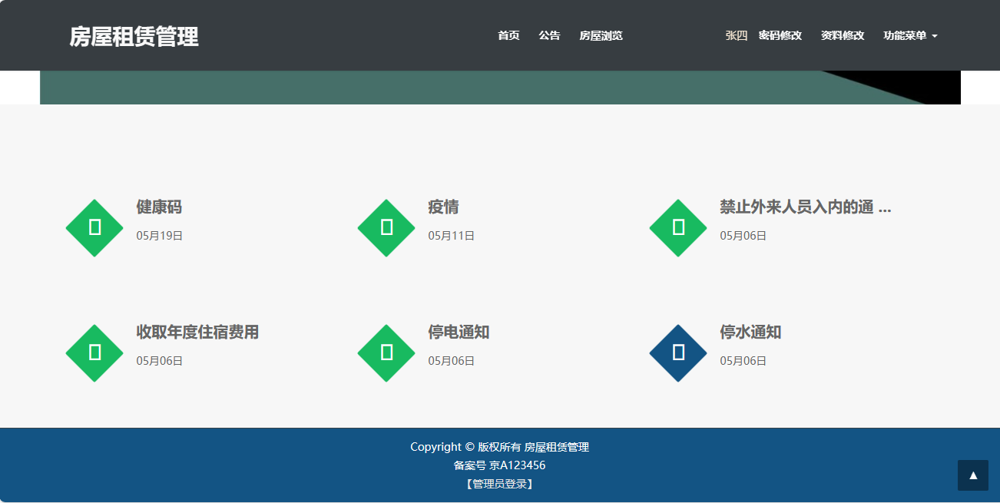
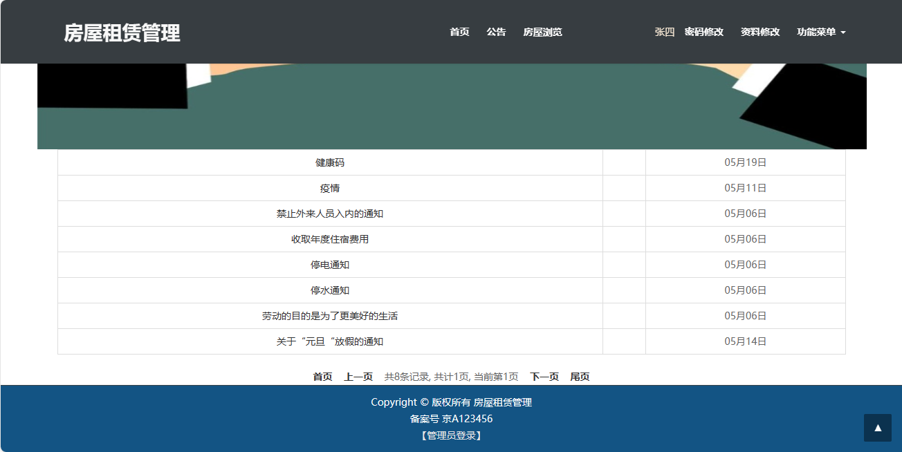
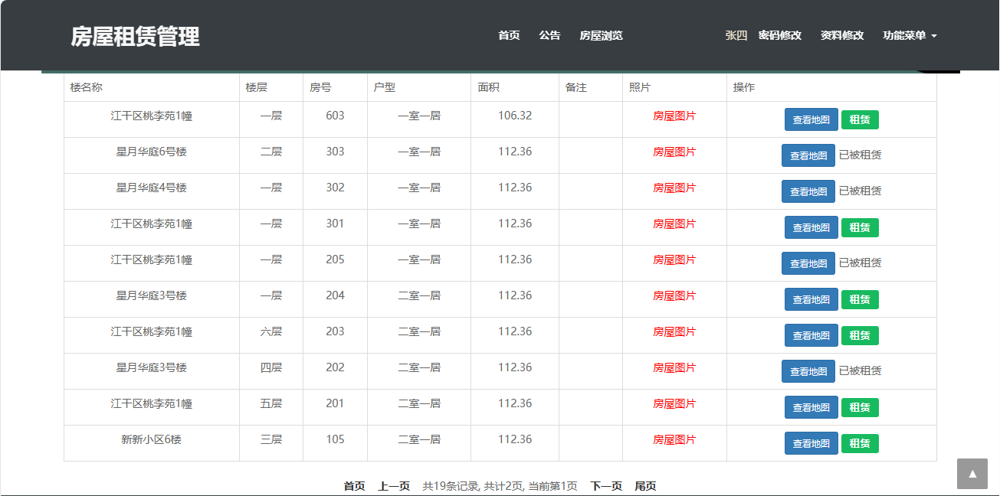
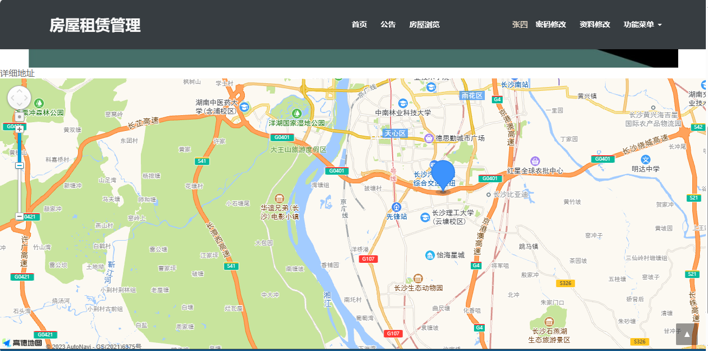
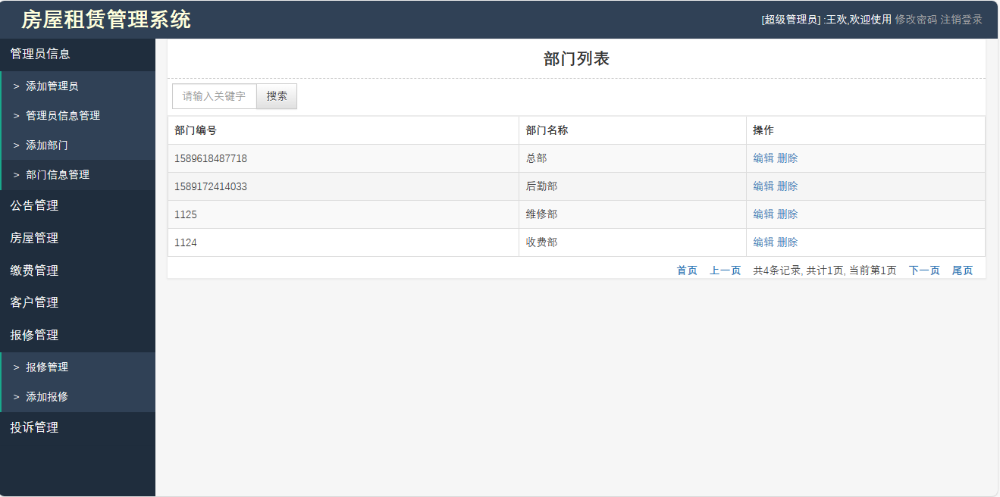
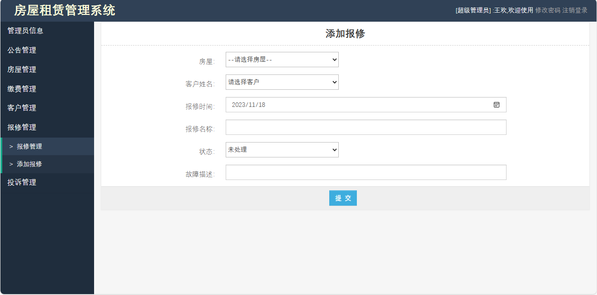

<h1 align="center">基于SSM的房屋租赁系统2</h1>

- 完整代码获取地址：从戎源码网 ([https://armycodes.com/](https://armycodes.com/))
- 作者微信：19941326836  QQ：952045282 
- 承接计算机毕业设计、Java毕业设计、Python毕业设计、深度学习、机器学习
- 选题+开题报告+任务书+程序定制+安装调试+论文+答辩ppt 一条龙服务
- 所有选题地址（https://github.com/YuLin-Coder/AllProjectCatalog）

## 项目介绍

基于SSM的房屋租赁系统，前端 Jsp、Bootstrap、Jquery，后端 Spring、Mybatis，系统角色分为：用户、系统管理员、缴费管理员、维修管理员，用户登录后在房屋浏览页面寻找到合适自己的房屋可以直接在线租赁或退租操作；主要功能如下：

### 用户：

- 基本功能：登录、注册、修改密码、资料修改、安全退出
- 首页、公告、房屋浏览、房屋租赁、房屋地图查看、房屋图片查看
- 我的房屋：已租房屋列表、房屋退租操作
- 报修管理：添加报修、报修列表、报修记录修改、报修记录删除
- 投诉管理：添加投诉、投诉列表查询、投诉修改、投诉删除
- 缴费管理：缴费记录列表、在线支付、退款

### 系统管理员：

- 管理员信息：添加管理员（管理员权限分为超级管理员、缴费管理员、维修管理员）、管理员列表查询、关键词搜索、管理员信息编辑、管理员信息删除
- 部门信息管理：添加部门、部门信息编辑、部门信息删除
- 公告管理：公告内容编辑（支持富文本编辑）、发布公告、公告列表查询、关键词搜索、公告删除
- 地址管理：添加地址（经纬度、高德地图）、地址列表查询、地址修改、地址删除
- 房屋管理：房屋添加（地址选择、照片上传）、房屋列表查询、房屋图片查看、关键词搜索、房屋信息修改、房屋信息删除
- 缴费管理：添加缴费（房屋选择、客户选择、支付方式选择）、缴费列表查询、缴费处理、缴费记录删除
- 客户管理：添加客户、客户列表查询、客户信息修改、客户记录删除、关键词搜索
- 报修管理：添加报修（房屋选择、客户选择）、报修列表、报修处理、报修记录删除
- 投诉管理：添加投诉、投诉列表查询、投诉修改、投诉删除

### 缴费管理员：

- 公告管理：关键词搜索、公告列表查询、公告详情查看
- 缴费管理：添加缴费（房屋选择、客户选择、支付方式选择）、缴费列表查询、缴费处理、缴费记录删除

### 维修管理员：

- 公告管理：关键词搜索、公告列表查询、公告详情查看
- 报修管理：添加报修（房屋选择、客户选择）、报修列表、报修处理、报修记录删除

## 环境

- <b>IntelliJ IDEA 2009.3</b>
- <b>Mysql 5.7.26</b>
- <b>Tomcat 7.0.73</b>
- <b>JDK 1.8</b>

## 运行截图

